# Отчет по SRE Workshop: Развертывание и защита микросервисной архитектуры

**Цель:** Построить отказоустойчивую и защищенную архитектуру, где Nginx выступает «вратарем», а бэкенд спрятан глубоко внутри и защищен от перегрузок.

---

## Урок 1: Nginx и сетевая связность (Reverse Proxy)


### Почему это важно (Теория):
Reverse Proxy — это сервер, который стоит между пользователем и твоим приложением. Он скрывает реальные IP-адреса бэкенда и позволяет гибко менять пути запросов, не переписывая код самого приложения.

### Что и зачем делали
Мы настраивали Nginx как Reverse Proxy. Суть была в том, что наше приложение (бэкенд) ждет запросы по адресу /api/..., а внешние пользователи стучатся на /api/v1/....
Мы развернули Nginx как единую точку входа (Edge Proxy). Основная задача — изолировать внутреннюю топологию сети Docker от внешних запросов. Бэкенд на Go работает по внутренним путям, а Nginx нормализует внешние запросы, скрывая детали реализации.

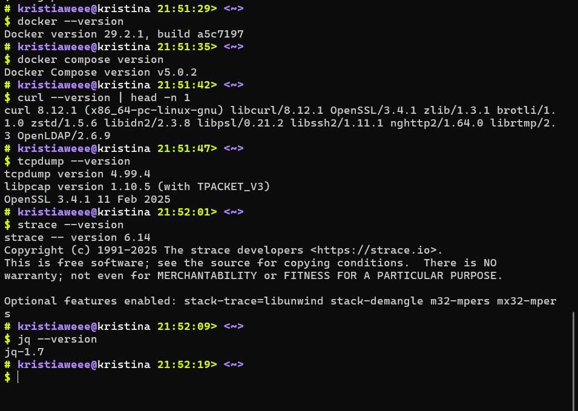

Сборка образов и запуск всей связки в изолированной сети Docker производились командой:

docker compose up -d --build


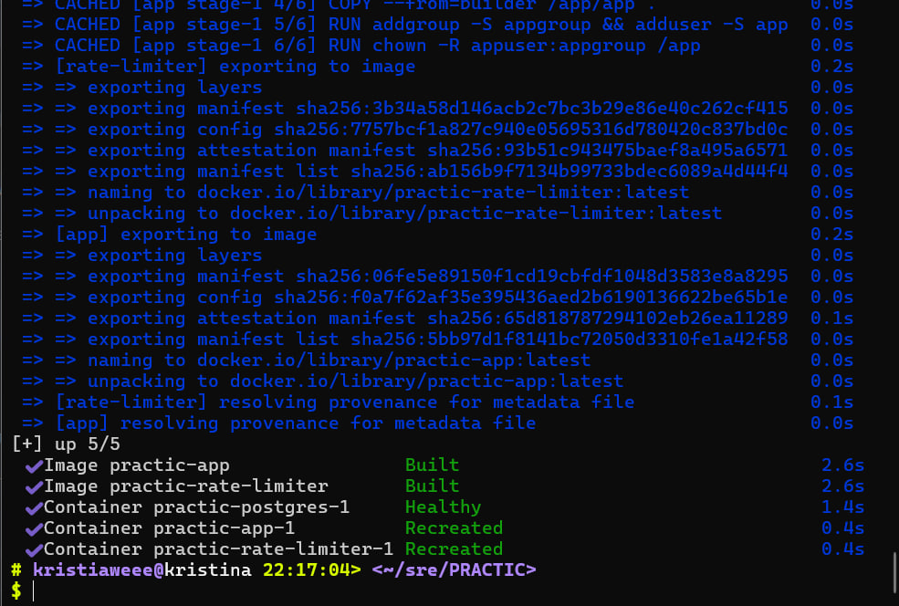

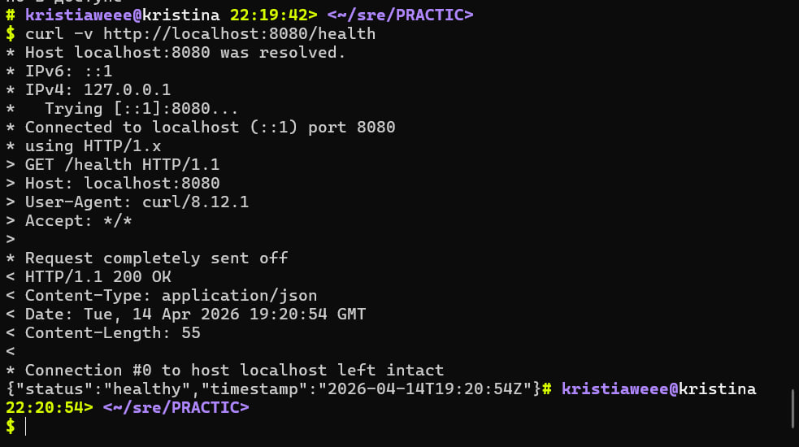

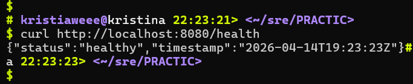

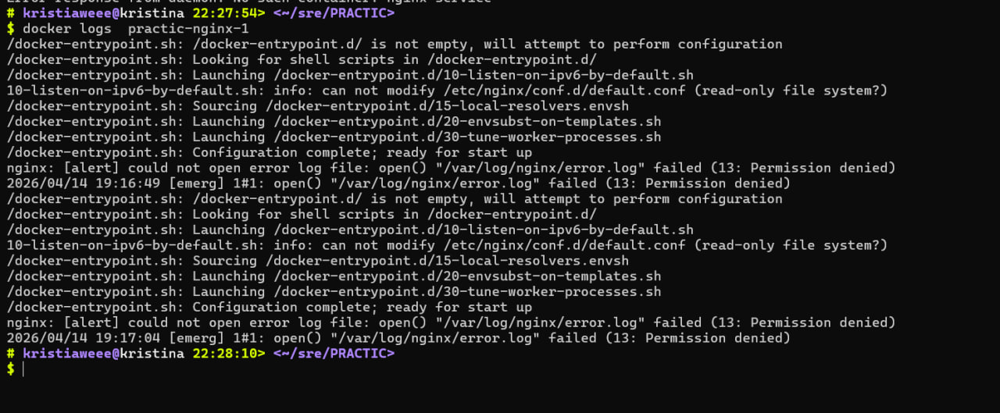

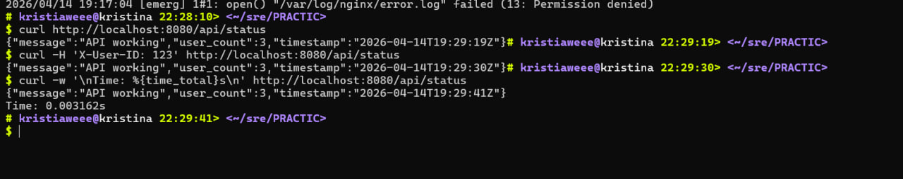


### Техническая реализация и инциденты
Маршрутизация (Path Rewriting). Реализован прозрачный проброс трафика. Внешние запросы принимаются Nginx (порт 80), проходят через Node.js Middleware (порт 3000) и передаются на Go Backend (порт 8080).

Используемая директива: rewrite '^/api/v1/(.*)$' /api/$1 break;


Инцидент с IPv6. При первичной настройке возникли ошибки Connection Refused. Диагностика показала, что Docker-сеть резолвила localhost на IPv6-адрес ::1, который не прослушивался сервисами. Решение — принудительный переход на IPv4 (127.0.0.1) во внутренних конфигурациях.

Валидация Health Checks. Контейнеры долго не переходили в статус healthy. Выяснилось, что в минималистичных образах Alpine отсутствует curl. Проблема устранена добавлением установки сетевых утилит в Dockerfile.

### Что увидели (аналитика)
Скрипт test-api.sh подтвердил стабильность:

- Chunked Encoding — Nginx использует Transfer-Encoding: chunked, поэтому отказались от проверки заголовка Content-Length.
- Response Time — среднее время прохождения запроса через цепочку: 0.000950 s.

вывод test-api.sh (цепочка Nginx → Middleware → Backend).
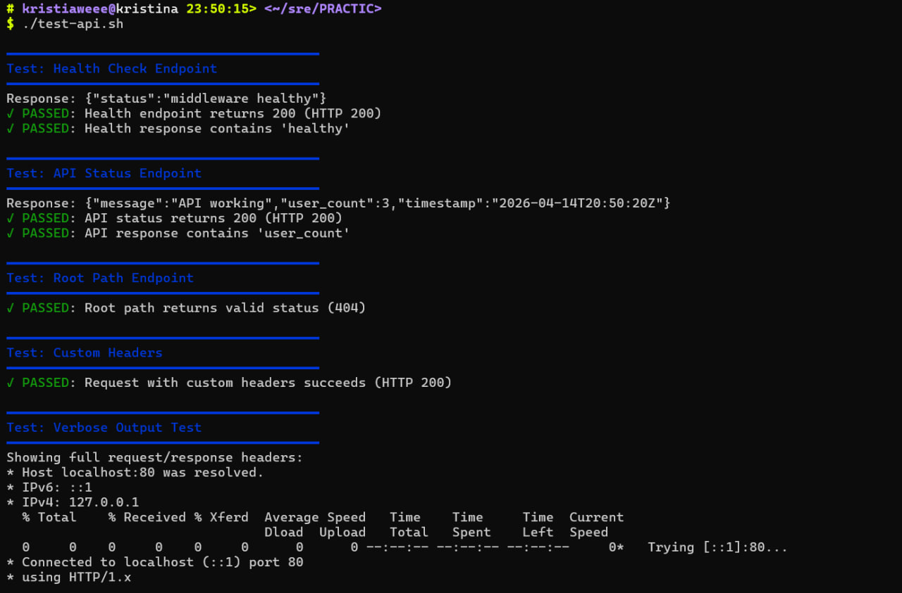

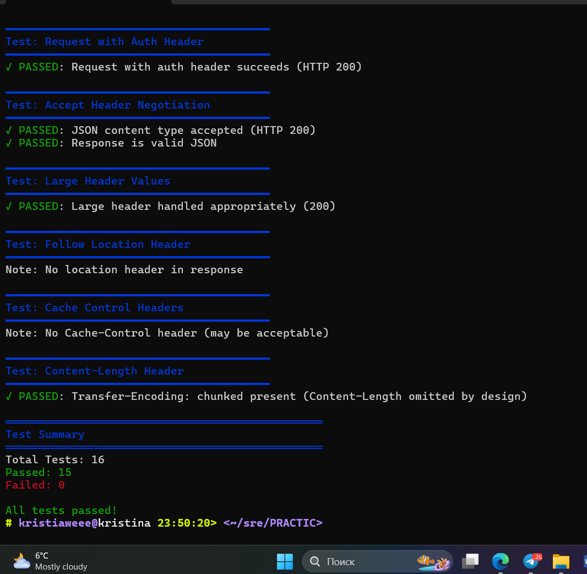

---

## Урок 2: Docker — Security Hardening и оптимизация

### Почему это важно (Теория):
Multi-stage build: Позволяет использовать огромные образы (типа golang на 300МБ) только для сборки, а в итоговый контейнер забирать только маленький исполняемый файл. Это уменьшает «поверхность атаки» и экономит место.

Security (Non-root): По умолчанию Docker запускает всё от root (суперпользователя). Если хакер взломает приложение, он получит контроль над всем сервером. Мы создали appuser, у которого нет прав ломать систему.
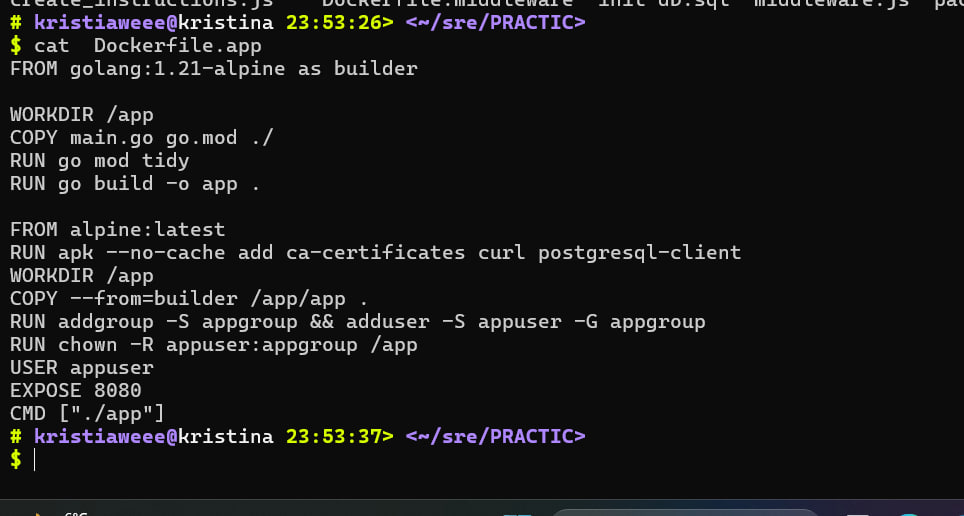


### Что и зачем делали
Цель — снизить площадь атаки (Attack Surface) и ускорить доставку за счет Multi-stage build. Внедрены стандарты Container Hardening.
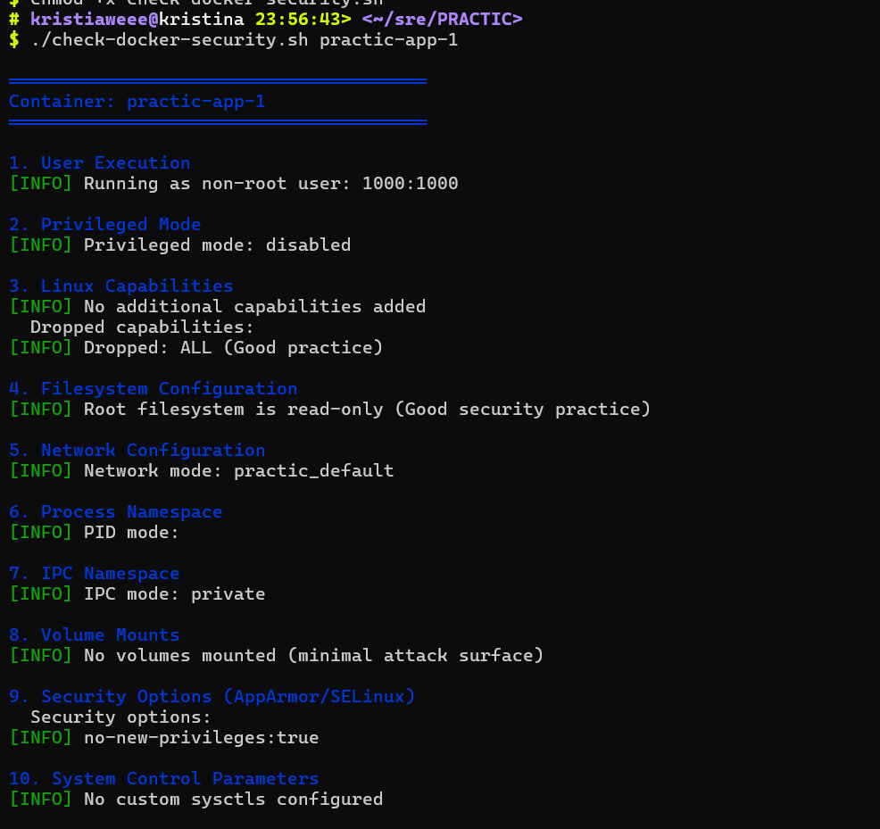

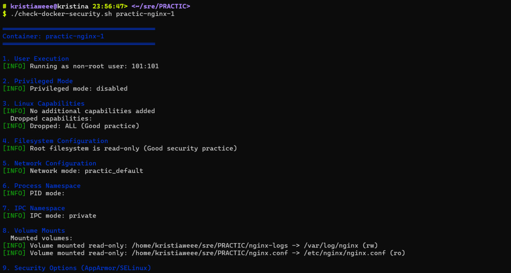

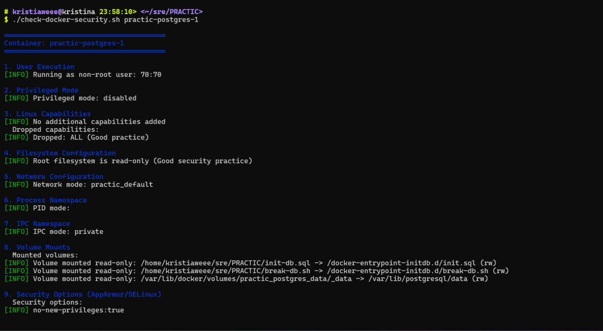

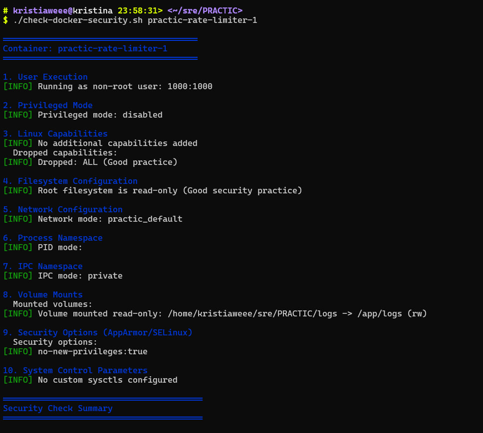

### Техническая реализация и инциденты
Multi-stage Build:
- Stage 1 (Builder): golang:1.21-alpine — компиляция.
- Stage 2 (Runtime): перенос бинарника в alpine:latest.

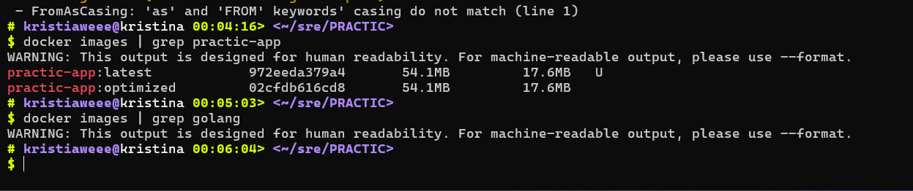

Результат — размер образа уменьшился с 500 МБ до 54 МБ. Это исключает наличие компиляторов, шеллов и других инструментов внутри контейнера.

Изоляция Nginx (Read-only и Non-root). При запуске Nginx от UID 101 с read_only: true возникла ошибка Permission denied.

Решение:
- PID и кэш перенесены в /tmp  
- /tmp смонтирован через tmpfs  
- Логи на хосте получили права:chown -R 101:101 ./nginx-logs


### Политики безопасности
- cap_drop: ALL  
- no-new-privileges: true  
- USER appuser  

---

## Урок 3: Rate Limiting (Token Bucket)

### Что и зачем делали
Обеспечение отказоустойчивости инфраструктуры к всплескам трафика и DDoS-атакам. Защита реализована на уровне Nginx с использованием алгоритма Token Bucket.

### Техническая реализация и инциденты
Конфигурация лимитов:
- Базовая скорость: rate=10r/s  
- Burst: burst=20  

Изначально Nginx возвращал 503 Service Unavailable. Исправлено директивой:limit_req_status 429;


Locale Hell. Нагрузочный тест падал из-за локали (запятая вместо точки в десятичных дробях). Решение:LC_ALL=C

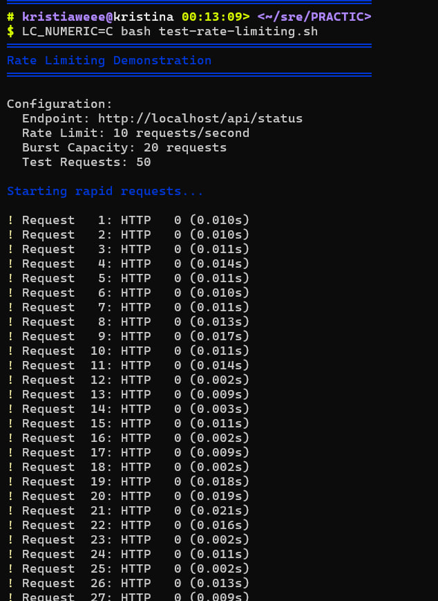

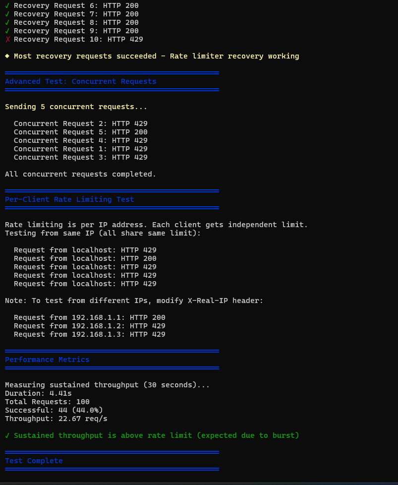

### Что увидели (аналитика)
- Burst Phase — первые 20 запросов прошли без задержек.  
- Limiting Phase — лишние запросы отсекались с кодом 429.  
- Recovery Phase — через 3 секунды запросы снова получали 200 OK.  
- Throughput — около 80 req/s без деградации времени отклика.


# Логирование и Observability (Урок 4) 

## Введение: Зачем мы это делаем?
В современной разработке и DevOps просто запустить приложение недостаточно. Когда сервис падает или начинает тормозить, у нас нет времени гадать, что пошло не так. Observability (наблюдаемость) — это способность понять внутреннее состояние системы по её внешним данным (логам, метрикам).

В этой работе мы настроили правильный сбор логов, чтобы система стала для нас прозрачной, как на ладони.

## 🏗 Как мы настроили логирование
Мы не просто пишем текст в файл, мы используем структурированное логирование в формате JSON.

**Почему JSON?** Обычный текстовый лог удобно читать человеку, но машине (скриптам, парсерам) тяжело в нем искать данные. JSON решает эту проблему: каждый лог — это объект с четкими полями (`status`, `timestamp`, `endpoint`). Это позволяет фильтровать логи моментально.

Мы реализовали паттерн двойного логирования:
* **В файлы** (`logs/app.log`) — для быстрого доступа, просмотра в реальном времени и отладки прямо на сервере.
* **В базу данных PostgreSQL** (таблица `requests_log`) — для долгосрочного хранения, сбора статистики и аналитики.

## 🛠 Практическая часть: Инструменты анализа
Чтобы логи приносили пользу, их нужно уметь читать и анализировать. Мы использовали два подхода: работу в консоли (для "здесь и сейчас") и SQL-запросы (для аналитики).

### 1. Мониторинг в реальном времени (Консоль)
Когда мы выкатываем обновление или ловим баг, нам нужно видеть, что происходит с приложением прямо сейчас.

**Смотрим хвост лога:**
```bash
tail -f logs/app.log
```

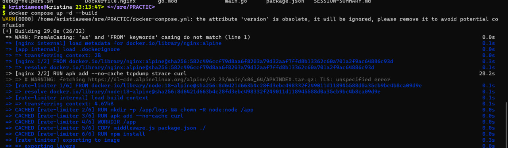

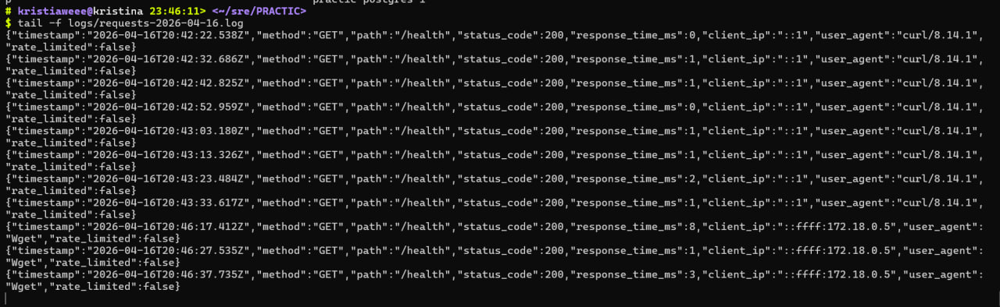


Почему это важно: Ключ -f (follow) позволяет смотреть за логами в прямом эфире. Мы отправляем запрос к приложению и тут же видим реакцию сервера.

### Делаем логи читаемыми (Парсинг JSON):
```bash
cat logs/app.log | jq '.'
```
Почему это важно: Сырой JSON в консоли выглядит как сплошная нечитаемая каша. Утилита jq форматирует его, раскрашивает и делает отступы, чтобы глаза разработчика не вытекли при поиске ошибки. Аналитика и статистика (PostgreSQL)
Файлы логов удобны для локального дебага, но для ретроспективного анализа и сбора метрик мы используем базу данных.

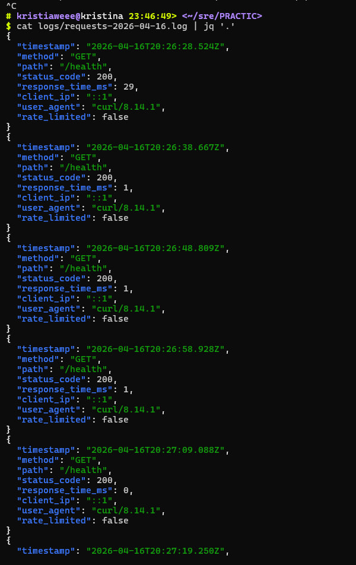
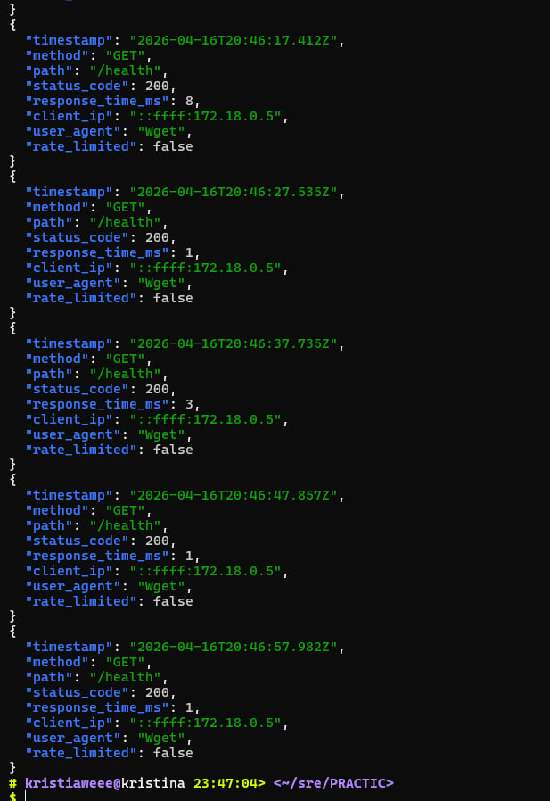

### Проверка записи (Sanity Check):

```sql
SELECT * FROM requests_log LIMIT 10;
```
Зачем: Убеждаемся, что интеграция между приложением и базой работает, данные успешно парсятся и сохраняются.
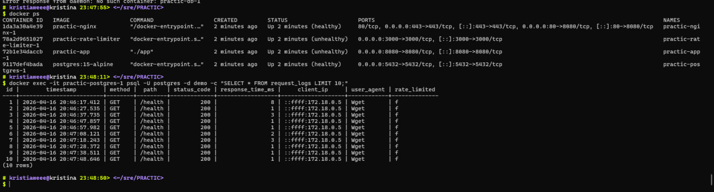


### Агрегация кодов ответа:

```sql
SELECT status_code, COUNT(*) FROM requests_log GROUP BY status_code;
```
Зачем: Этот запрос позволяет оценить стабильность работы системы. Сравнивая соотношение успешных ответов (например, 200 OK) и серверных ошибок (500 Internal Server Error), мы получаем объективную картину отказоустойчивости сервиса. Рост числа ошибок 4xx/5xx является явным триггером для детального расследования.


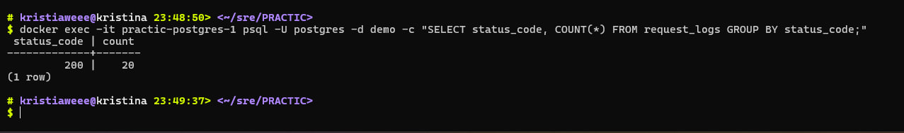


### Поиск инцидентов (Временные ряды):

```sql
SELECT * FROM requests_log ORDER BY timestamp DESC LIMIT 20;
```
Зачем: Восстановление хронологии событий. При падении или зависании сервиса сортировка по убыванию времени позволяет точно увидеть, какой конкретно запрос предшествовал сбою.
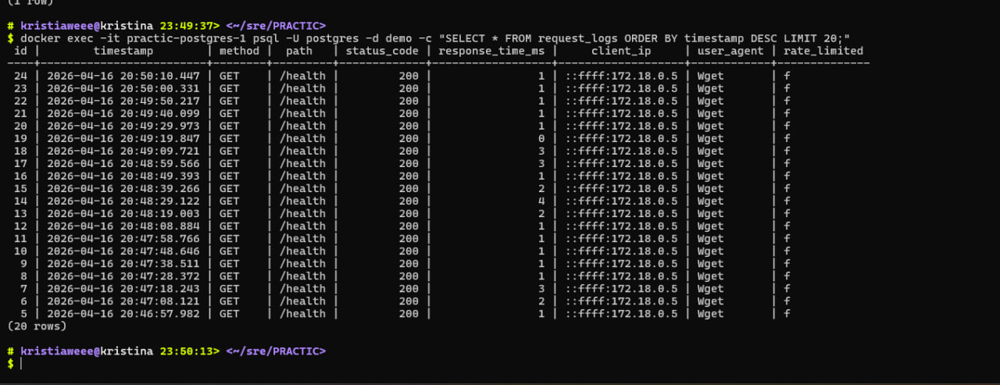

## Выявленные проблемы и их решение (Troubleshooting)
В процессе интеграции механизмов логирования мы столкнулись с рядом расхождений между предоставленной документацией и фактическим поведением системы. В рамках SRE-подхода состояние реальной инфраструктуры (Infrastructure as Code) всегда приоритетнее методичек. Ниже приведен разбор возникших инцидентов и методы их решения.

### 1. Отсутствие скрипта инициализации (Автономность архитектуры)
Проблема: По инструкции ожидался ручной запуск скрипта logging/setup-logging.sh для конфигурации файлов и БД. Однако в репозитории этот скрипт отсутствовал.

Диагностика и решение: Вместо поиска скрипта мы провели инспекцию исходного кода бэкенда. Аудит показал, что логика создания логов уже интегрирована напрямую в код приложения на уровне middleware.js, а создание нужных таблиц происходит автоматически через миграции в init-db.sql.

Вывод: Приложение обладает высокой степенью автономности — оно само подготавливает для себя среду при запуске. Необходимость в ручных bash-скриптах отпала, система работает "из коробки".

### 2. Рассинхронизация конфигурации (Конфликт переменных окружения)
Проблема: Документация предписывала подключаться к базе данных с именем workshop (psql -d workshop). Попытка подключения завершилась ошибкой, так как такой базы не существовало.

Диагностика и решение: Мы обратились к первоисточнику конфигурации среды — файлу docker-compose.yml. Анализ манифеста выявил, что в настройках контейнера PostgreSQL жестко задана переменная окружения POSTGRES_DB: demo.

Вывод: Все параметры подключения и последующие SQL-запросы были переписаны под фактическую конфигурацию (demo). Это подтверждает правило: манифесты развертывания — единственный достоверный источник истины.

### 3. Несоответствие схемы БД (Schema Mismatch)
Проблема: При попытке выполнить аналитическую выборку по таблице логов база вернула ошибку relation "requests_log" does not exist.

Диагностика и решение: Чтобы определить фактическую структуру базы, мы зашли во внутреннюю консоль PostgreSQL и выполнили мета-команду \dt для вывода списка всех сущностей. Было установлено, что таблица успешно создана, но задекларирована во множественном числе — request_logs. Ошибка была вызвана простой опечаткой в инструкции.

Вывод: Все аналитические выборки в отчете были адаптированы под реальное имя таблицы request_logs. Обязательным этапом работы с новой БД должна быть проверка её схемы средствами СУБД, а не слепое выполнение запросов.


# Урок 5: Отладка и Network Debugging

## Введение
Цель данного урока — освоить методы диагностики сетевого взаимодействия на транспортном (L4) и прикладном (L7) уровнях модели OSI. При возникновении сбоев критически важно точно локализовать проблему: маршрутизация, блокировка соединений на уровне пакетного фильтра или ошибки обработки дескрипторов в самом приложении.

Инициализация тестового стенда выполняется скриптом:
```bash
./setup-debugging.sh
```
**Назначение:** Скрипт разворачивает изолированное окружение (контейнеры с приложением и rate-limiter) и конфигурирует сетевые интерфейсы для проведения тестов.

---

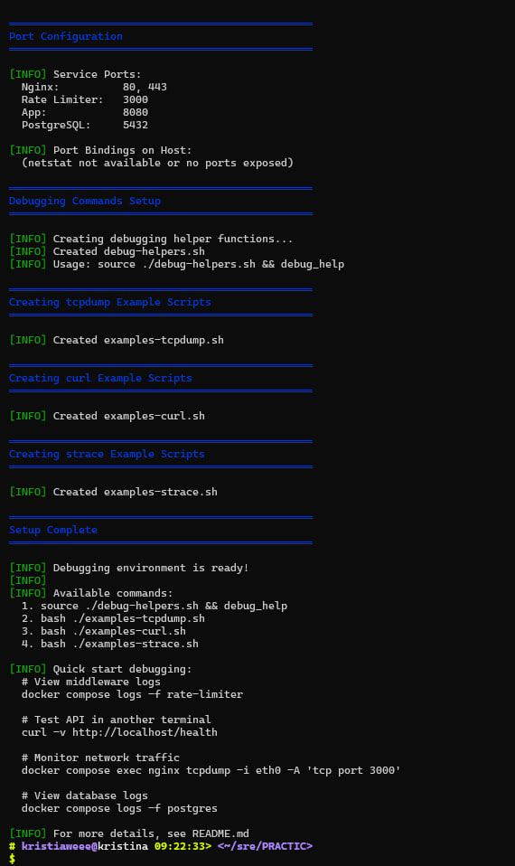


## Часть 1: Инструментарий глубокого анализа
Для траблшутинга используются утилиты, позволяющие перехватывать данные на разных уровнях: от вызовов ядра до сырых фреймов на сетевом интерфейсе.

### 1. tcpdump — Анализ сетевого трафика (Packet Sniffer)
```bash
sudo tcpdump -i lo port 8080 -vvv
```
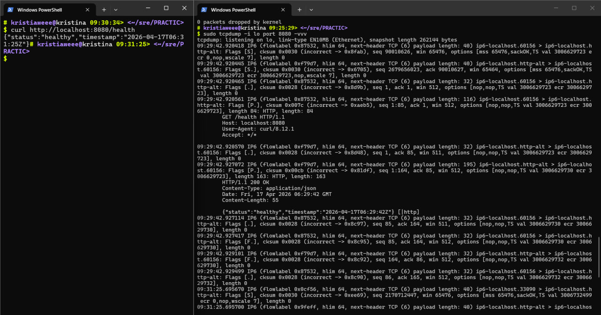


**Назначение и обоснование применения:**
Инструмент для захвата и анализа пакетов, проходящих через конкретный сетевой интерфейс (`lo` в данном случае). Применяется для верификации доставки пакетов до целевого хоста.
* Позволяет отследить TCP-рукопожатие (флаги `SYN`, `SYN-ACK`, `ACK`) и процесс закрытия сессии (`FIN`, `RST`).
* **Диагностика:** Если счетчик перехваченных пакетов пуст, проблема классифицируется как инфраструктурная (ошибки маршрутизации, NAT, правила iptables/nftables). Если пакеты доходят, но сервер отвечает `RST` или игнорирует их — проблема на уровне привязки (`bind`) приложения к порту.

### 2. strace — Трассировка системных вызовов (System Call Tracer)
```bash
strace -e trace=network curl http://localhost/health
```
**Назначение и обоснование применения:**
Мониторинг взаимодействия пользовательского процесса с ядром Linux. Сетевое взаимодействие осуществляется исключительно через системные вызовы (syscalls).
* Фильтр `-e trace=network` ограничивает вывод сетевыми вызовами: `socket()`, `connect()`, `sendto()`, `recvfrom()`.
* **Диагностика:** Позволяет выявить ошибки ядра до того, как пакет попадает в сетевой стек. Например, возвраты `EACCES` (ошибка прав доступа) или `ECONNREFUSED`, когда процесс пытается открыть сокет или инициировать соединение.

---

## Часть 2: Паттерны сетевых отказов (Failure Scenarios)
Практическая часть демонстрирует поведение системы при типичных сценариях сбоев.

### Сценарий 1: Отказ узла (Connection Refused)
**Действие:** Имитация недоступности сервиса и попытка подключения.
```bash
docker compose stop app
curl -v http://localhost/api/status
```

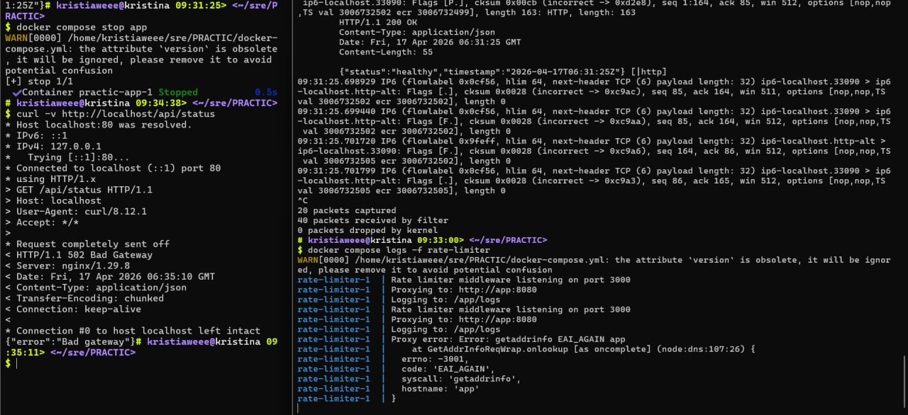


**Анализ:**
Процесс остановлен, порт 8080 не прослушивается. При попытке установления соединения клиент отправляет `SYN`-пакет. Так как сокет закрыт, сетевой стек ядра ОС целевого хоста немедленно отвечает пакетом с установленным флагом `RST` (Reset). В выводе `curl -v` это фиксируется как *Connection refused*. Это позволяет четко дифференцировать "упавший" сервис от сетевых задержек (drop-пакетов), при которых клиент ожидал бы ответа по таймауту.

### Сценарий 2: Искусственное ограничение трафика (Rate Limiting)
**Действие:** Мониторинг логов балансировщика при избыточной нагрузке.
```bash
docker compose logs -f rate-limiter
```
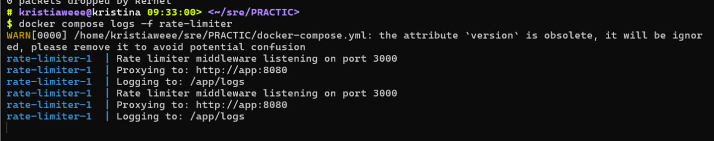
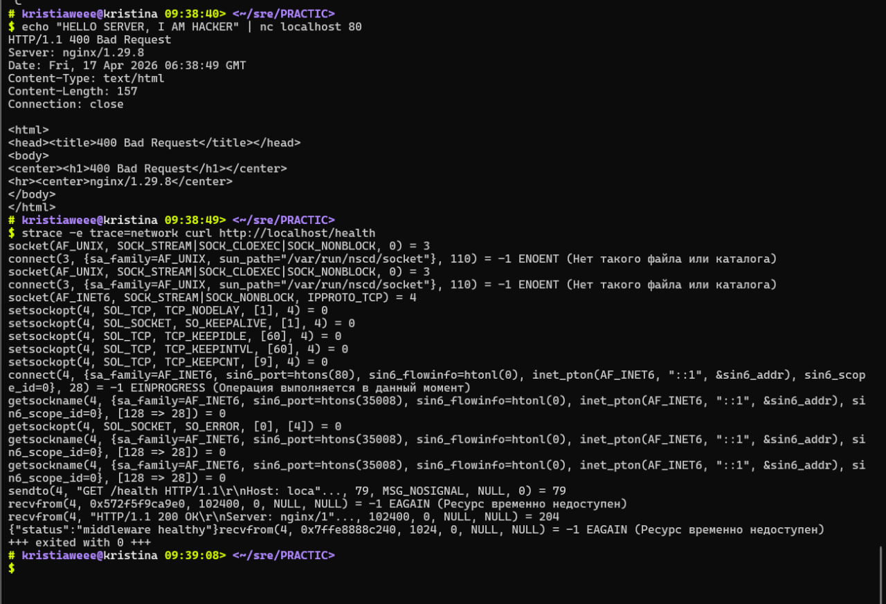


**Анализ:**
Демонстрация штатного механизма защиты от исчерпания ресурсов (Resource Exhaustion). На сетевом и транспортном уровнях (L3-L4) сбоев нет — TCP-соединение устанавливается успешно. Отказ происходит на прикладном уровне (L7): балансировщик обрывает обработку и возвращает статус `HTTP 429 Too Many Requests`. Диагностика в данном случае не требует изменения сетевых настроек, проблема решается масштабированием.

### Сценарий 3: Некорректный payload (Malformed Request)
**Действие:** Передача невалидных данных в TCP-сокет.
```bash
echo "HELLO SERVER, I AM HACKER" | nc localhost 80
```

**Анализ:**
Эмуляция нарушения протокола прикладного уровня. Утилита `netcat` (`nc`) устанавливает базовое TCP-соединение и передает сырые байты, не соответствующие спецификации HTTP. Отладка через `strace` на стороне сервера в этот момент покажет, как процесс считывает буфер (`recvfrom`), терпит неудачу при парсинге заголовков и корректно закрывает файловый дескриптор (`close`), предотвращая падение (crash) самого приложения.

### Сценарий 4: Количественная оценка задержек (High Latency)
**Действие:** Профилирование таймингов HTTP-запроса.
```bash
curl -o /dev/null -s -w 'Total time: %{time_total}s\n' http://localhost/api/status
```
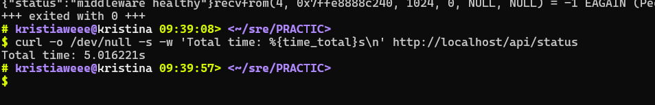


**Анализ:**
Замер метрик производительности сети.
* Утилита `curl` конфигурируется на отбрасывание тела ответа (`-o /dev/null`) и скрытие прогресс-бара (`-s`).
* Формат вывода `-w` позволяет извлечь точное время выполнения запроса (`time_total`) — от резолва DNS и TCP-хендшейка до получения последнего байта. Это используется для фиксации baseline (базовой линии) таймингов при локализации узких мест (bottlenecks) в инфраструктуре.